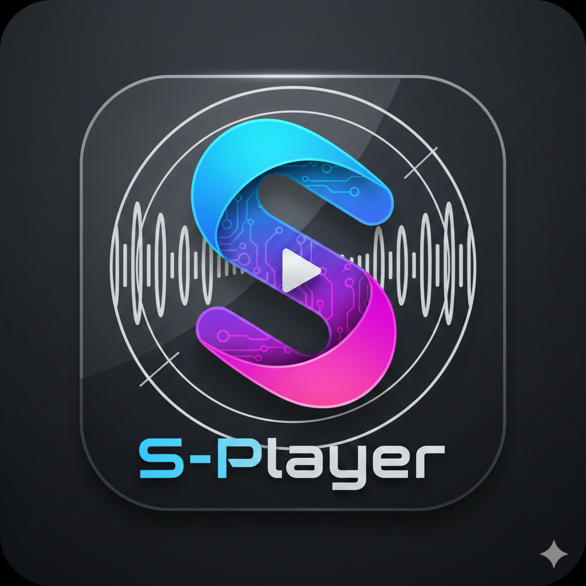

# S-Player



基于 MPV 的现代化桌面视频播放器，专为蓝光原盘和高质量视频打造。

## ✨ 功能特性

### 🎬 视频播放
- 支持常见视频格式 (MKV, MP4, AVI, MOV, M2TS)
- 支持蓝光原盘 (ISO/文件夹) 和 DVD 原盘
- 支持 HDR / 杜比视界
- GPU 硬件加速解码

### 🔊 音频与字幕
- 多音轨切换，支持 DTS-HD MA、TrueHD、Atmos 等高清音频
- 多字幕切换，支持 PGS、SRT、ASS 等格式
- 自动选择中文音轨和字幕
- 实时显示音频编码和声道信息

### 📑 高级功能
- 章节跳转
- 蓝光多标题切换（自动识别主标题）
- TMDB 电影信息自动获取（海报、简介、演员）
- 实时码率显示
- 画质增强（去色带、插帧等）

### 🎨 现代化界面
- 简洁优雅的 UI 设计
- 毛玻璃效果
- 独立的信息面板
- 自动隐藏控制栏
- 自定义窗口控制

## 🚀 快速开始

### 环境要求
- Node.js 16+
- Windows 10/11

### 安装步骤

1. **克隆项目**
```bash
git clone https://github.com/yourusername/s-player.git
cd s-player
```

2. **安装依赖**
```bash
npm install
```

3. **下载 MPV**
   - 从 [MPV 官网](https://mpv.io/installation/) 下载 Windows 版本
   - 将 `mpv.exe` 放到项目根目录

4. **开发模式**
```bash
npm start
```

5. **打包应用**
```bash
npm run dist
```

打包后的应用在 `dist` 目录下。

## 📁 项目结构

```
s-player/
├── electron/
│   ├── main.js      # Electron 主进程，MPV 进程管理
│   └── preload.js   # 预加载脚本，IPC 通信桥接
├── src/
│   ├── App.jsx      # React 主组件，播放器 UI
│   ├── main.jsx     # React 入口
│   └── index.css    # 全局样式
├── index.html       # HTML 入口
├── vite.config.js   # Vite 配置
├── mpv.exe          # MPV 播放器（需自行下载）
├── mpv.doc          # MPV 文档
└── package.json     # 项目配置
```

## 🛠️ 技术栈

- **Electron** - 跨平台桌面应用框架
- **React** - 声明式 UI 框架
- **Vite** - 快速的前端构建工具
- **MPV** - 强大的视频播放核心
- **Lucide React** - 现代化图标库
- **TMDB API** - 电影数据库

## 📝 开发说明

### MPV 参数配置
项目使用了以下 MPV 参数优化播放体验：
- `--hwdec=auto-safe` - 自动硬件解码
- `--vo=gpu-next` - 使用新版 GPU 渲染
- `--scale=ewa_lanczossharp` - 高质量缩放
- `--deband=yes` - 去色带
- `--audio-fallback-to-null=yes` - 音频驱动回退

### 蓝光原盘支持
- 自动解析蓝光标题列表
- 按时长排序，最长的标记为主标题
- 支持标题切换（需重启 MPV 进程）

### TMDB 集成
- 自动从文件名提取电影标题和年份
- 支持合集识别（如 "Movie1+Movie2"）
- 获取中文电影信息、海报和演员

## 🐛 已知问题

- 切换标题时需要重启 MPV 进程（MPV 限制）
- 部分 HDR 视频可能需要手动调整显示器设置

## 🔮 未来计划

- [ ] 播放列表支持
- [ ] 字幕样式自定义
- [ ] 音频均衡器
- [ ] 截图功能
- [ ] 播放历史记录
- [ ] macOS 和 Linux 支持

## 👨‍💻 作者

**Qasim**  
📧 15750783791@163.com

## 📄 License

MIT License - 详见 [LICENSE](LICENSE) 文件

## 🙏 致谢

- [MPV](https://mpv.io/) - 强大的媒体播放器
- [Electron](https://www.electronjs.org/) - 跨平台桌面应用框架
- [TMDB](https://www.themoviedb.org/) - 电影数据库 API
- [Lucide](https://lucide.dev/) - 精美的图标库

---

⭐ 如果这个项目对你有帮助，请给个 Star！
